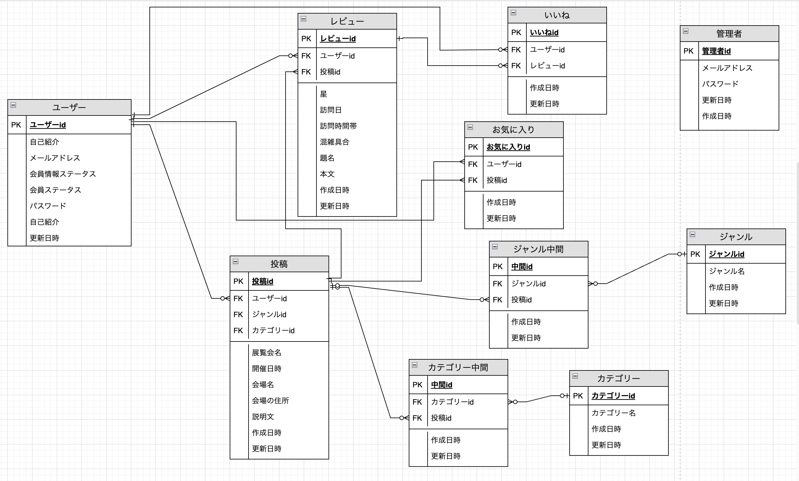
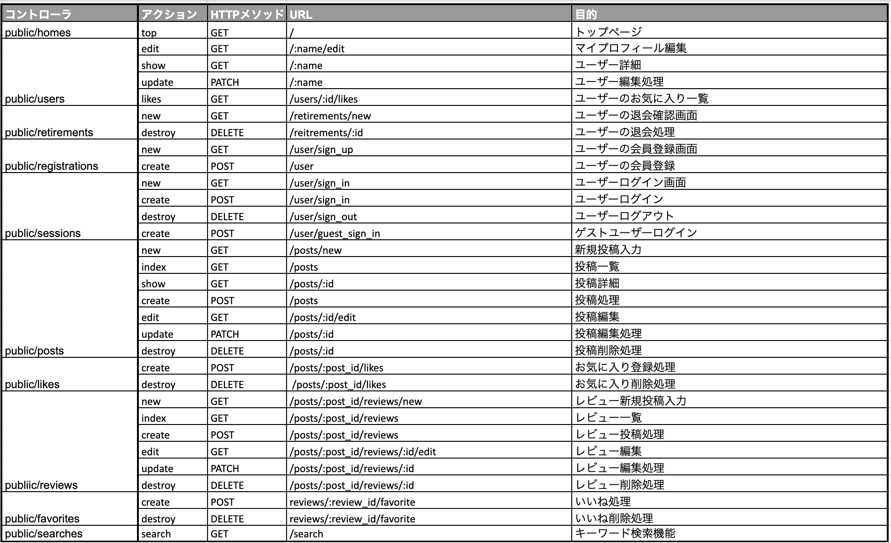
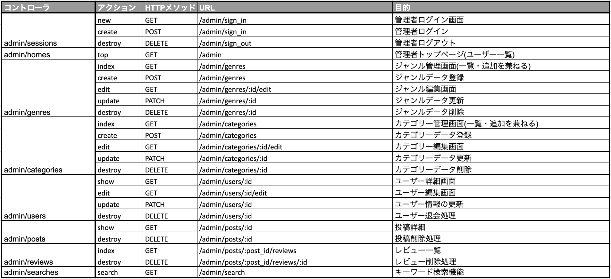

# README

# もみじ
​
## サイト概要
### サイトテーマ
日本美術の展覧会情報の検索とレビューサイト
​
### テーマを選んだ理由
日本美術が好きで、展覧会へ行くのですが、日本美術は保存の観点から展覧会の開催期間が短く、また公開される機会の少ない作品も多くあります。そのため展覧会の情報を知った時には既に終了している、日程が合わず行けないこともよくあります。
気になる展覧会情報を素早くキャッチでき、また忙しい時でも短時間で展覧会へ足を運べるよう開催されている展覧会の周辺情報や混雑状況などをシェアできるサービスがあれば良いなと考えました。
なかなか見ることのできない貴重な作品の公開を多くの人に知ってもらい、足を運ぶ機会を作ることで、日本美術の保護にも繋げたいと考え、このテーマを選びました。
​
### ターゲットユーザ
・好きな作品が公開される展覧会を知りたい人

・あまり展覧会に行ったことはないが、訪れてみたいと考えている人

・展覧会の開催を広く知ってもらいたい開催者の方
​
### 主な利用シーン
・自分の好きな時代、作者の展覧会情報を調べたい時

・行きたい展覧会の周辺情報や混雑状況を知りたい時

・展覧会開催者が展覧会を知ってもらいたい時

・趣味の合う人との交流がしたい時
​
## 設計書
- ER図

- アプリケーション詳細設計

​
## 開発環境
- OS：Linux(Amazon Linux release 2023)
- 言語：HTML,CSS,JavaScript,Ruby,SQL
- フレームワーク：Ruby on Rails
- CSSフレームワーク:Bootstrap
- JSライブラリ：jQuery
- IDE：Cloud9
​
## 使用素材
- 展覧会の情報（開催場所、日程）は全て架空です。
- フリー素材として以下を使用
miri canvas(https://www.miricanvas.com/)
